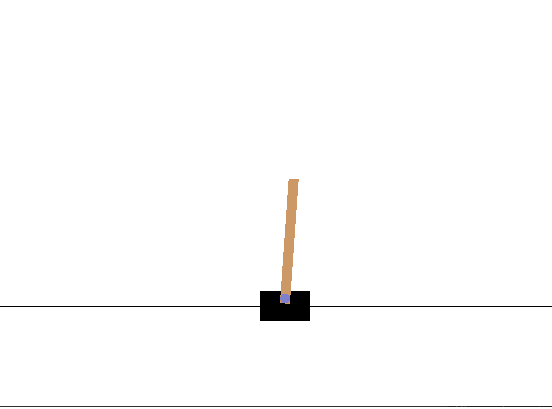

# RL-Gym
```angular2html
Reinforce Learning Example based on Gym library

```


Tested on Anaconda Envs (py36-pytorch-tf-gpu.yml)
 - python 3.6
 - tensorflow 1.10.0
  
  
  ```angular2html
files:
 main.py : simple example in library, we can see how Gym libs work
 RL-main.py : the first designed NN 
```